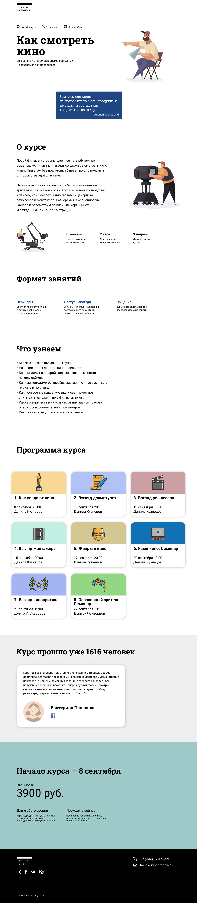
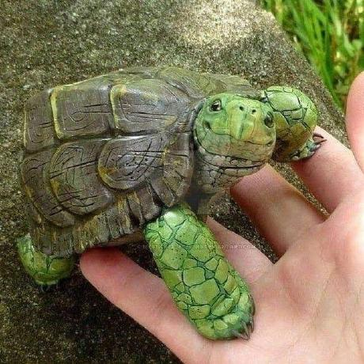

# Algorithmics - Course Landing Page

This is a solution to the [Algorithmics Modul One Final Project](https://www.figma.com/file/69KkWov2CX66UaxNFRpxN4/m1-project-acb-part-time?node-id=0%3A1). Algorithmics project help us improve our coding skills by building realistic projects.

## Table of contents

- [Overview](#overview)
  - [The Project](#the-project)
  - [Screenshot](#screenshot)
  - [Links](#links)
- [My process](#my-process)
  - [Built with](#built-with)
  - [Useful resources](#useful-resources)
- [Authors](#authors)

## Overview

### The Project

Users should be able to:

- All spaces, sizes and colors must be in accordance with the layout and requirements.
- Slight differences with the layout are allowed in the size, spaces.
- The page should display correctly in all modern browsers.
- The page is adaptive and available in three main variants:
  - Desktop - screen size more than 1280px;
  - Tablet - screen size from 992px to 1279px;
  - Smartphone - screen size from 320px to 991px.
- Within each screen option, the "rubber" layout, that is, the width of the elements, changes proportionally to the screen width.
- All interface decisions that are not considered in the layout are made by the programmer.
- The project should be organized as follows:
  - The HTML page uses an external style file in the project folder;
  - HTML inline styling is not allowed;
  - Images are placed in a separate folder.
- The project must pass the Validator check.
- Correct layout semantics must be observed.
- The Page Code should be stored in the GitHub repository.

### ScreenShot

### Links

- [Solution URL](https://github.com/RaviHamidov/AlgorithmicsProject)
- [Live Site URL](https://leafy-moxie-ac0327.netlify.app/)

## Our process

### Built with

- Technologys

  - HTML
  - CSS
  - JS
  - BootStrap 5
  - FontAwesome

### Note for Better UnderStanding

- All Project's code Organized I mean that Beautify, Readable, Understandable.
- In this Project writen with BEM Methodology.
- We only used pure HTML and CSS and a bit of Bootstrap for Resposivity, we write everything from scratch,
  Don't used utilize any no code tools like Wix, Wordpress etc.
- We used Visual Studio Code while writing code and a bit of extensions like "Prettier", "Bootstrap 5 Quick Snippets", "Live Server" to write more productive code . . .

- Our Folder Structure (for this Project)
  - design
    - figma.html
  - src
    - icon
      - icon.html
    - img
      - imageOne.png
      - imageTwo.png
      - etc . . .
    - style
      - main.css
  - index.html
  - ReadMe.md

### Useful resources

- As Soon As ;

## Authors

| No  | Name / SurName                                      | Image                                                                                    | Role                 |
| --- | --------------------------------------------------- | ---------------------------------------------------------------------------------------- | -------------------- |
| 1   | [Ravi Hamidov](https://github.com/RaviHamidov)      |    | Full Stack Developer |
| 2   | [Rahima Mahmudzade](https://github.com/rahima18)    |  | Front End Developer  |
| 3   | [Zakir Memmedli](https://github.com/Zaiqer)         |  | Front End Developer  |
| 4   | [Nermin Qasimli](https://github.com/narmin-gasimli) |   | Front End Developer  |
| 5   | [Sadiq Memmedov](https://github.com/Sadibra)        |   | Front End Developer  |
